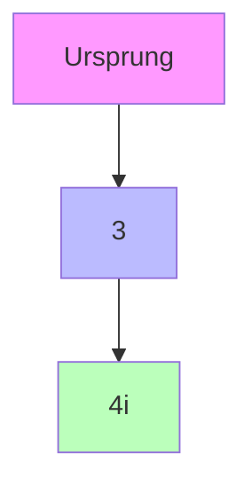

# Lösungen zu komplexen Zahlen

## 1. Grundlagen

### Aufgabe 1: Darstellung komplexer Zahlen
Gegeben: z = 3 + 4i

Lösung:
- Realteil: Re(z) = 3
- Imaginärteil: Im(z) = 4
- Betrag: |z| = √(3² + 4²) = 5
- Argument: φ = arctan(4/3) ≈ 53.13°

### Aufgabe 2: Konjugiert komplexe Zahl
Gegeben: z = 2 - 3i

Lösung:
- Konjugiert komplexe Zahl: z̄ = 2 + 3i
- z · z̄ = (2 - 3i)(2 + 3i) = 4 + 9 = 13

## 2. Rechenoperationen

### Aufgabe 1: Addition
Gegeben: z₁ = 2 + 3i, z₂ = 1 - 2i

Lösung:
z₁ + z₂ = (2 + 1) + (3 - 2)i = 3 + i

### Aufgabe 2: Multiplikation
Gegeben: z₁ = 1 + 2i, z₂ = 3 - i

Lösung:
z₁ · z₂ = (1 + 2i)(3 - i) = 3 - i + 6i - 2i² = 3 + 5i + 2 = 5 + 5i

### Aufgabe 3: Division
Gegeben: z₁ = 4 + 3i, z₂ = 1 + 2i

Lösung:
z₁/z₂ = (4 + 3i)/(1 + 2i) = (4 + 3i)(1 - 2i)/(1 + 2i)(1 - 2i) = (4 - 8i + 3i - 6i²)/(1 + 4) = (10 - 5i)/5 = 2 - i

## 3. Polardarstellung

### Aufgabe 1: Umwandlung in Polardarstellung
Gegeben: z = 1 + i

Lösung:
- Betrag: |z| = √(1² + 1²) = √2
- Argument: φ = arctan(1/1) = 45° = π/4
- Polardarstellung: z = √2 · e^(iπ/4)

### Aufgabe 2: Multiplikation in Polardarstellung
Gegeben: z₁ = 2e^(iπ/3), z₂ = 3e^(iπ/6)

Lösung:
z₁ · z₂ = 2 · 3 · e^(i(π/3 + π/6)) = 6e^(iπ/2)

## 4. Komplexe Wurzeln

### Aufgabe 1: Quadratwurzel
Gegeben: z = -4

Lösung:
√(-4) = ±2i

### Aufgabe 2: n-te Wurzel
Gegeben: z = 1

Lösung:
Die n-ten Einheitswurzeln sind:
ω_k = e^(2πik/n) für k = 0,1,...,n-1

## 5. Komplexe Funktionen

### Aufgabe 1: Exponentialfunktion
Gegeben: z = 1 + i

Lösung:
e^z = e^(1+i) = e · e^i = e(cos(1) + i·sin(1))

### Aufgabe 2: Trigonometrische Funktionen
Gegeben: z = i

Lösung:
sin(i) = (e^(-1) - e^1)/(2i) = i·sinh(1)
cos(i) = (e^(-1) + e^1)/2 = cosh(1)

## 6. Komplexe Gleichungen

### Aufgabe 1: Quadratische Gleichung
Gegeben: z² + 2z + 5 = 0

Lösung:
z = (-2 ± √(4 - 20))/2 = (-2 ± √(-16))/2 = -1 ± 2i

### Aufgabe 2: Polynomgleichung
Gegeben: z³ = 1

Lösung:
z = e^(2πik/3) für k = 0,1,2
z₁ = 1
z₂ = -1/2 + i√3/2
z₃ = -1/2 - i√3/2

## 7. Geometrische Interpretation

### Aufgabe 1: Komplexe Zahlen in der Ebene
Gegeben: z = 3 + 4i

Lösung:

### Aufgabe 2: Multiplikation geometrisch
Gegeben: z₁ = 2e^(iπ/4), z₂ = 3e^(iπ/6)

Lösung:
- Betrag wird multipliziert: 2 · 3 = 6
- Winkel werden addiert: π/4 + π/6 = 5π/12

## 8. Anwendungen

### Aufgabe 1: Wechselstromrechnung
Gegeben: U = 220V, I = 10A, φ = 30°

Lösung:
- Komplexe Spannung: U = 220e^(i30°)
- Komplexe Stromstärke: I = 10e^(i0°)
- Komplexe Leistung: S = U · Ī = 2200e^(i30°)

### Aufgabe 2: Signalverarbeitung
Gegeben: Signal f(t) = cos(ωt) + i·sin(ωt)

Lösung:
- Komplexe Darstellung: f(t) = e^(iωt)
- Frequenz: ω/(2π)
- Amplitude: 1 