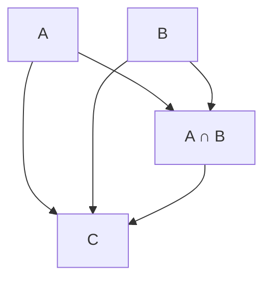
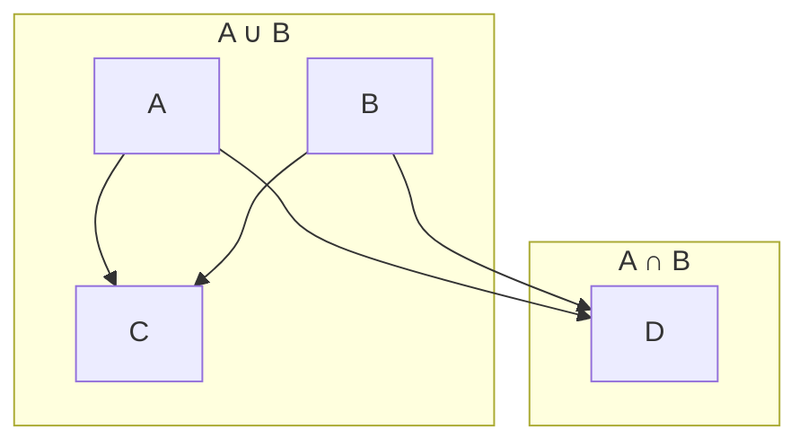
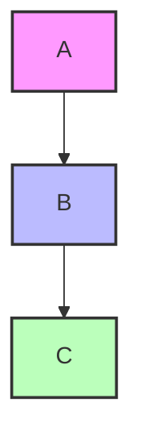
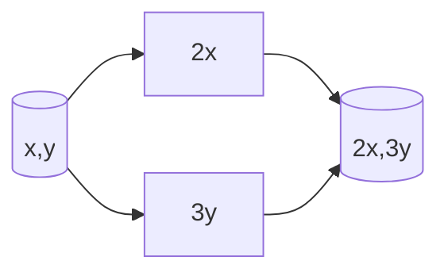
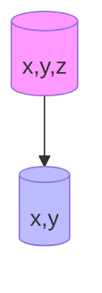
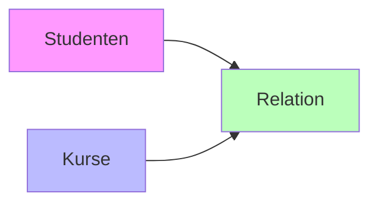
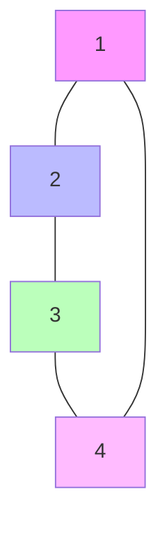
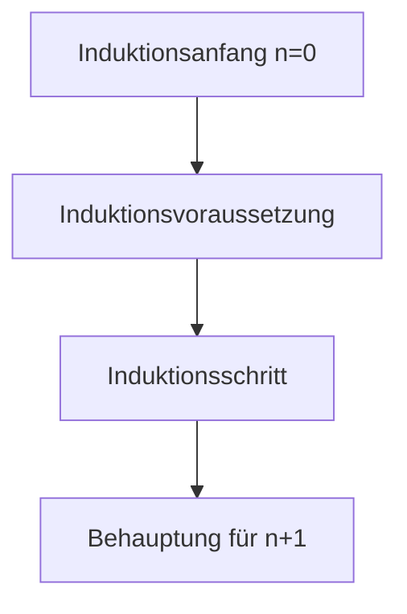
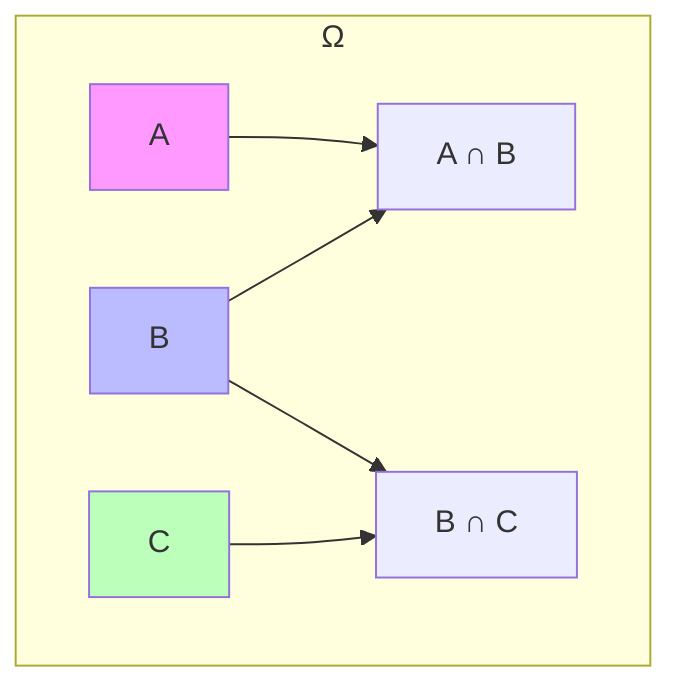

# Lösungen zu Mengen und Abbildungen

## 1. Mengenoperationen

### Aufgabe 1: Vereinigungsmenge
Gegeben: A = {1, 2, 3}, B = {3, 4, 5}

Lösung:
A ∪ B = {1, 2, 3, 4, 5}

### Aufgabe 2: Schnittmenge
Gegeben: A = {1, 2, 3, 4}, B = {3, 4, 5, 6}

Lösung:
A ∩ B = {3, 4}

### Aufgabe 3: Differenzmenge
Gegeben: A = {1, 2, 3, 4}, B = {3, 4, 5}

Lösung:
A \ B = {1, 2}

## 2. Abbildungen

### Aufgabe 1: Injektivität
Gegeben: f: ℝ → ℝ, f(x) = 2x + 1

Lösung:
Die Funktion ist injektiv, da für alle x₁, x₂ ∈ ℝ gilt:
f(x₁) = f(x₂) ⇒ 2x₁ + 1 = 2x₂ + 1 ⇒ x₁ = x₂

### Aufgabe 2: Surjektivität
Gegeben: f: ℝ → ℝ, f(x) = x²

Lösung:
Die Funktion ist nicht surjektiv, da negative Zahlen nicht als Funktionswerte auftreten.

### Aufgabe 3: Bijektivität
Gegeben: f: ℝ → ℝ, f(x) = x³

Lösung:
Die Funktion ist bijektiv, da sie sowohl injektiv als auch surjektiv ist.

## 3. Komposition von Abbildungen

### Aufgabe 1
Gegeben: f(x) = 2x, g(x) = x + 3

Lösung:
(f ∘ g)(x) = f(g(x)) = 2(x + 3) = 2x + 6
(g ∘ f)(x) = g(f(x)) = 2x + 3

## 4. Umkehrfunktionen

### Aufgabe 1
Gegeben: f: ℝ → ℝ, f(x) = 3x - 2

Lösung:
Die Umkehrfunktion f⁻¹ ist:
f⁻¹(x) = (x + 2)/3

## 5. Mengendiagramme

### Venn-Diagramm für drei Mengen


## 6. Beweise

### Aufgabe 1: Distributivgesetz
Zu zeigen: A ∩ (B ∪ C) = (A ∩ B) ∪ (A ∩ C)

Beweis:
1. Sei x ∈ A ∩ (B ∪ C)
   ⇒ x ∈ A und x ∈ (B ∪ C)
   ⇒ x ∈ A und (x ∈ B oder x ∈ C)
   ⇒ (x ∈ A und x ∈ B) oder (x ∈ A und x ∈ C)
   ⇒ x ∈ (A ∩ B) ∪ (A ∩ C)

2. Sei x ∈ (A ∩ B) ∪ (A ∩ C)
   ⇒ x ∈ (A ∩ B) oder x ∈ (A ∩ C)
   ⇒ (x ∈ A und x ∈ B) oder (x ∈ A und x ∈ C)
   ⇒ x ∈ A und (x ∈ B oder x ∈ C)
   ⇒ x ∈ A ∩ (B ∪ C)

## 7. Anwendungsbeispiele

### Aufgabe 1: Mengen in der Wahrscheinlichkeitstheorie
Gegeben: Ω = {1,2,3,4,5,6}, A = {2,4,6}, B = {1,2,3}

Lösung:
- A ∪ B = {1,2,3,4,6}
- A ∩ B = {2}
- A \ B = {4,6}
- B \ A = {1,3}

## 8. Erweiterte Mengenoperationen

### Aufgabe 1: Potenzmenge
Gegeben: A = {1, 2}

Lösung:
P(A) = {∅, {1}, {2}, {1,2}}

### Aufgabe 2: Kartesisches Produkt
Gegeben: A = {1, 2}, B = {a, b}

Lösung:
A × B = {(1,a), (1,b), (2,a), (2,b)}

## 9. Komplexe Mengendiagramme

### Aufgabe 1: De Morgan'sche Gesetze


### Aufgabe 2: Mengeninklusion


## 10. Abbildungen mit speziellen Eigenschaften

### Aufgabe 1: Lineare Abbildung
Gegeben: f: ℝ² → ℝ², f(x,y) = (2x, 3y)

Lösung:
- Injektiv: Ja, da die Determinante der zugehörigen Matrix 6 ≠ 0
- Surjektiv: Ja, da die Abbildung bijektiv ist
- Graphische Darstellung:


### Aufgabe 2: Projektion
Gegeben: π: ℝ³ → ℝ², π(x,y,z) = (x,y)

Lösung:
- Injektiv: Nein, da z beliebig sein kann
- Surjektiv: Ja, da jedes (x,y) ∈ ℝ² ein Urbild hat
- Graphische Darstellung:


## 11. Beweise mit Mengendiagrammen

### Aufgabe 1: Assoziativgesetz der Vereinigung
Zu zeigen: (A ∪ B) ∪ C = A ∪ (B ∪ C)

Beweis mit Venn-Diagramm:
```mermaid
graph TD
    subgraph "(A ∪ B) ∪ C"
        A[A] --> AB[A ∪ B]
        B[B] --> AB
        AB --> ABC[(A ∪ B) ∪ C]
        C[C] --> ABC
    end
    subgraph "A ∪ (B ∪ C)"
        B --> BC[B ∪ C]
        C --> BC
        A --> ABC2[A ∪ (B ∪ C)]
        BC --> ABC2
    end
```

## 12. Anwendungsbeispiele aus der Informatik

### Aufgabe 1: Relationen in Datenbanken
Gegeben: 
- A = {Studenten}
- B = {Kurse}
- R ⊆ A × B = {(s,k) | Student s besucht Kurs k}

Lösung:


### Aufgabe 2: Graphentheorie
Gegeben: G = (V,E) mit V = {1,2,3,4}, E = {{1,2}, {2,3}, {3,4}, {4,1}}

Lösung:


## 13. Komplexe Beweise

### Aufgabe 1: Mächtigkeit von Mengen
Gegeben: |A| = n, |B| = m

Lösung:
- |A × B| = n·m
- |P(A)| = 2ⁿ
- Beweis durch vollständige Induktion:


## 14. Praktische Anwendungen

### Aufgabe 1: Mengen in der Wahrscheinlichkeitstheorie
Gegeben: Ω = {1,2,3,4,5,6}, A = {2,4,6}, B = {1,2,3}, C = {3,5}

Lösung:


### Aufgabe 2: Mengen in der Logik
Gegeben: A = {x | P(x)}, B = {x | Q(x)}

Lösung:
- A ∩ B = {x | P(x) ∧ Q(x)}
- A ∪ B = {x | P(x) ∨ Q(x)}
- A \ B = {x | P(x) ∧ ¬Q(x)} 